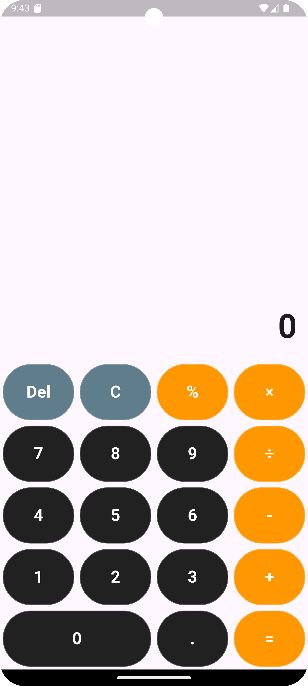

# Simple Calculator App

A Flutter project.

## Introduction

This project presents a simple calculator application developed using the Flutter framework. The calculator supports basic arithmetic operations such as addition, subtraction, multiplication, and division. The primary goal of this project is to provide a functional and user-friendly calculator interface while adhering to best practices in software development.

## Features

- **Basic Arithmetic Operations**: Supports addition, subtraction, multiplication, and division.
- **Percentage Calculation**: Includes functionality for converting numbers to percentages.
- **Clear and Delete Functions**: Allows users to clear the entire input or delete the last entered character.
- **Responsive Design**: Ensures optimal user experience across various screen sizes.

## Screenshot

## Code Overview

### main.dart File

The 'main.dart' file serves as the entry point for the application. It initializes the app and sets up the basic theme and title.

### button_values.dart File

The 'button_values.dart' file defines the constants for button labels and their values used in the calculator.

### calculator_screen.dart File

The 'calculator_screen.dart' file contains the main logic and UI components for the calculator screen.

## Getting Started

### Prerequisites

To run this project, you need to have Flutter installed on your machine. For installation instructions, refer to the official Flutter documentation.

## Usage

Once the application is running, you can use the calculator to perform basic arithmetic operations by tapping the corresponding buttons.

## License

This project is licensed under the MIT License. See the LICENSE file for more details.

## Acknowledgements

- Flutter framework for providing the necessary tools and libraries.
- The open-source community for their continuous support and contributions.
